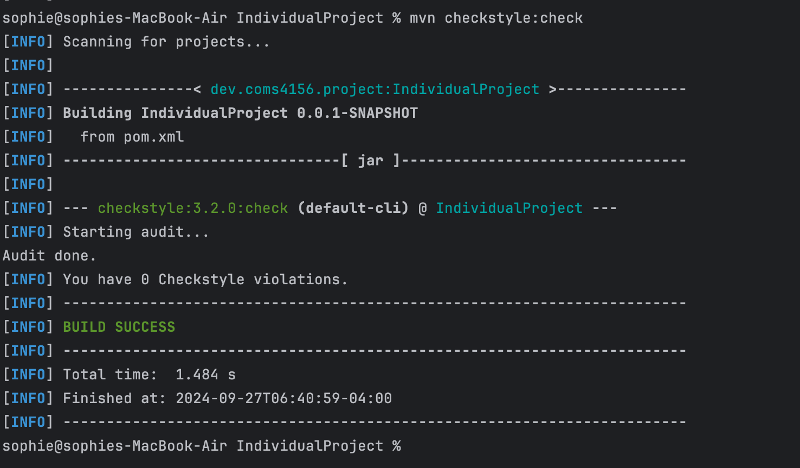
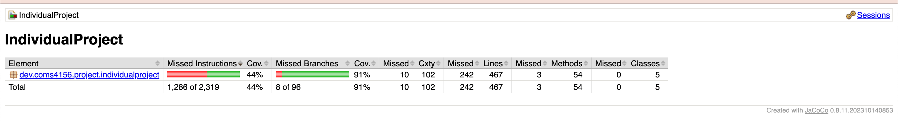
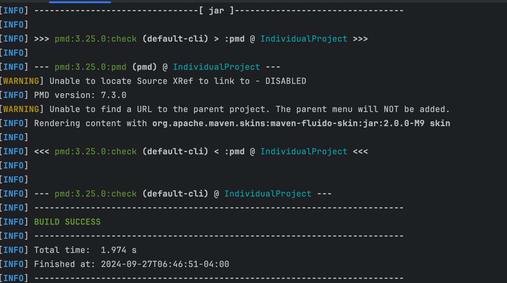

# Indicidual Project for 4156

This is the GitHub repository for an individual project of COMS4156 Advanced Software Engineering.

## Viewing original assignment repo
This project is forked from https://github.com/Programming-Systems-Lab/4156-Miniproject-2024-Students-Java

## Building and Running a Local Instance
In order to build and use our service you must install the following (This guide assumes Mac):

1. Maven 3.9.5: https://maven.apache.org/download.cgi
2. JDK 17: https://www.oracle.com/java/technologies/javase/jdk17-archive-downloads.html
3. IntelliJ IDE: https://www.jetbrains.com/idea/
4. After you clone this project, go to /IndividualProject and run ```mvn spring-boot:run -Dspring-boot.run.arguments="setup"```.
5. If you wish to check the style, run ```mvn checkstyle:check```.
6. If you wish to see coverage report, run ```mvn clean test jacoco:report``` and the coverage report is in the target/site/jacoco.
7. If you wish to do static analysis, run ```mvn pmd:check``` and the analysis result is in the `target/pmd.xml` file.

Our endpoints are listed below in the "Endpoints" section, with brief descriptions of their parameters.

## Running a Cloud based Instance
I have deployed the service to Google Cloud Platform. You can access the service at https://my-project-4156-436813.ue.r.appspot.com/

## Running Tests
All the test file are under the directory 'src/test'.

1. Tests can be run with ```mvn clean test jacoco:report``` in terminal.
2. The coverage report is in the target/site/jacoco directory.

## Endpoints

**GET/retrieveDept**
- Parameters: deptCode (String)
- Return: object containing either the details of the Department with provided info.
- Upon Success: HTTP 200 Status Code is returned along with the details of the department if it exist.
- Upon Failure: HTTP 404 Status Code with "Department Not Found" if it doesn't exist.

**GET/retrieveCourse**
- Parameters: deptCode (String), courseCode (int)
- Return: object containing the details of the course with provided info.
- Upon Success: HTTP 200 Status Code is returned along with the details of the course if it exists.
- Upon Failure: HTTP 404 Status Code with "Course Not Found" if it doesn't exist.

**GET/retrieveCourses**
- Parameters: courseCode (int)
- Return: object with the String representation of all the courses with the specified course code.
- Upon Success: HTTP 200 Status Code is returned along with all the courses with the specified course code if they exist.
- Upon Failure: HTTP 404 Status Code with "Course Not Found" if it doesn't exist.

**GET/isCourseFull**
- Parameters: deptCode (String), courseCode (int)
- Return: whether the course has at minimum reached its enrollmentCapacity.
- Upon Success: HTTP 200 Status Code is returned along with whether the course has at minimum reached its enrollmentCapacity if it exists.
- Upon Failure: HTTP 404 Status Code with "Course Not Found" if it doesn't exist.

**GET/getMajorCountFromDept**
- Parameters: deptCode (String)
- Return: object with string displaying the number of majors in the specified department.
- Upon Success: HTTP 200 Status Code is returned along with the number of majors in the specified department if it exists.
- Upon Failure: HTTP 404 Status Code with "Department Not Found" if it doesn't exist.

**GET/idDeptChair**
- Parameters: deptCode (String)
- Return: object with string displaying the department chair for the specified department.
- Upon Success: HTTP 200 Status Code is returned along with the department chair for the specified department if it exists.
- Upon Failure: HTTP 404 Status Code with "Department Not Found" if it doesn't exist.

**GET/findCourseLocation**
- Parameters: deptCode (String), courseCode (int)
- Return: object with string displaying the location for the specified course.
- Upon Success: HTTP 200 Status Code is returned along with the location for the specified course if it exists.
- Upon Failure: HTTP 404 Status Code with "Course Not Found" if it doesn't exist.

**GET/findCourseInstructor**
- Parameters: deptCode (String), courseCode (int)
- Return: object with string displaying the instructor for the specified course.
- Upon Success: HTTP 200 Status Code is returned along with the instructor for the specified course if it exists.
- Upon Failure: HTTP 404 Status Code with "Course Not Found" if it doesn't exist.

**GET/findCourseTime**
- Parameters: deptCode (String), courseCode (int)
- Return: object with string displaying the time for the specified course.
- Upon Success: HTTP 200 Status Code is returned along with the time for the specified course if it exists.
- Upon Failure: HTTP 404 Status Code with "Course Not Found" if it doesn't exist.

**Patch/addMajorToDept**
- Parameters: deptCode (String)
- Return: object with string displaying whether add is successful or not.
- Upon Success: HTTP 200 Status Code is returned along with "Attribute was updated successfully" if it exists.
- Upon Failure: HTTP 404 Status Code with "Department Not Found" if it doesn't exist.

**Patch/removeMajorFromDept**
- Parameters: deptCode (String)
- Return: object with string displaying whether remove is successful or not.
- Upon Success: HTTP 200 Status Code is returned along with "Attribute was updated successfully is at minimum" if it exists.
- Upon Failure: HTTP 404 Status Code with "Department Not Found" if it doesn't exist.

**Patch/dropStudentFromCourse**
- Parameters: deptCode (String), courseCode (int)
- Return: object with string displaying whether dropping is successful or not.
- Upon Success: HTTP 200 Status Code is returned along with "Student has been dropped." if it exists and student is dropped successfully.
- Upon Failure: 2 cases, HTTP 400 Status Code with "Student has not been dropped." if course exists but the student can't be dropped (reach minimum); HTTP 404 Status Code with "Course Not Found" if it doesn't exist.

**Patch/enrollStudentInCourse**
- Parameters: deptCode (String), courseCode (int)
- Return: object displaying whether enrolling is successful or not.
- Upon Success: HTTP 200 Status Code is returned along with "Student has been enrolled." if it exists and student is dropped successfully.
- Upon Failure: 2 cases, HTTP 400 Status Code with "Student has not been enrolled." if course exists but the student can't be enrolled (reach maximum); HTTP 404 Status Code with "Course Not Found" if it doesn't exist.

**Patch/setEnrollmentCount**
- Parameters: deptCode (String), courseCode (int), count (int)
- Return: object with string displaying whether setting count is successful or not.
- Upon Success: HTTP 200 Status Code is returned along with "Attributed was updated successfully." if it exists and student is dropped successfully.
- Upon Failure: HTTP 404 Status Code with "Course Not Found" if it doesn't exist.

**Patch/changeCourseTime**
- Parameters: deptCode (String), courseCode (int)
- Return: object with string displaying whether changing time is successful or not.
- Upon Success: HTTP 200 Status Code is returned along with "Attributed was updated successfully." if it exists.
- Upon Failure: HTTP 404 Status Code with "Course Not Found" if it doesn't exist.

**Patch/changeCourseTeacher**
- Parameters: deptCode (String), courseCode (int)
- Return: object with string displaying whether changing teacher is successful or not.
- Upon Success: HTTP 200 Status Code is returned along with "Attributed was updated successfully." if it exists.
- Upon Failure: HTTP 404 Status Code with "Course Not Found" if it doesn't exist.

**Patch/changeCourseLocation**
- Parameters: deptCode (String), courseCode (int)
- Return: object with string displaying whether changing location is successful or not.
- Upon Success: HTTP 200 Status Code is returned along with "Attributed was updated successfully." if it exists.
- Upon Failure: HTTP 404 Status Code with "Course Not Found" if it doesn't exist.


## Style Checking Report
The style checking report is in the `target/pmd.xml` file.
If there is no report, run ```mvn checkstyle:check``` to generate the report.
Here is the report as of the day of 09/27/24:


## Branch Coverage Reporting
The branch coverage report is in the `target/site/jacoco` directory.
If there is no report, run ```mvn clean test jacoco:report``` to generate the report.
Here is the report as of the day of 09/27/24:


## Static Analysis Report
The static analysis report is in the `target/pmd.xml` file.
If there is no report, run ```mvn pmd:check``` to generate the report.
Here is the report as of the day of 09/27/24:


## Continuous Integration Report
This repository using GitHub Actions to perform continous integration, to view the latest results go to the following link: https://github.com/sophiefeifeifeiya/Private-4156-Miniproject-2024-Students-Java/blob/main/.github/workflows/maven.yml

## Tools 
- IntelliJ IDEA
- Maven
- Spring Boot
- Google Cloud Platform
- GitHub Actions
- Checkstyle
- Jacoco
- PMD
- JUnit
- Postman
